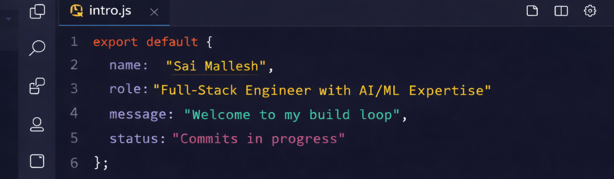

My experience spans frontend development, backend services, and deployment workflows. I enjoy designing clean APIs, building intuitive user interfaces, and delivering reliable systems using modern cloud and CI/CD practices.
## What I Work With

**Languages**  
Java · JavaScript · TypeScript · Python

**Frontend**  
React · Angular · HTML · CSS

**Backend**  
Spring Boot · Node.js · REST APIs · Microservices

**Databases**  
PostgreSQL · MySQL · MongoDB

**AI / Machine Learning / Deep Learning**  
Python · TensorFlow · Deep Learning · Image Classification · AI Model Inference · ML Pipelines

**Cloud & DevOps**  
AWS · GCP · Docker · CI/CD (GitHub Actions)

## Selected Projects

- **CollabSync** – Full-stack collaboration platform with authentication, file uploads, and cloud deployment  
- **Bird Identifier App** – Image classification application with a React frontend and backend inference APIs  
- **Essay Editor** – TypeScript-based web editor focusing on clean UI and state management

